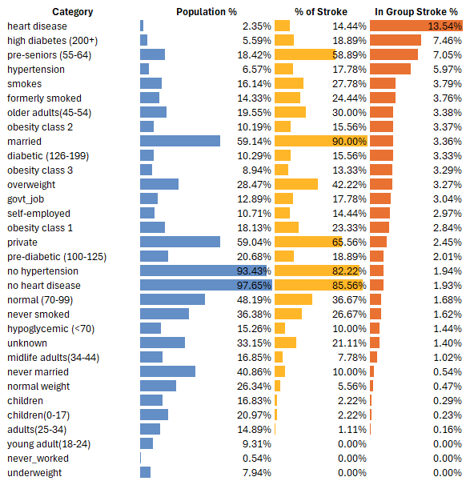
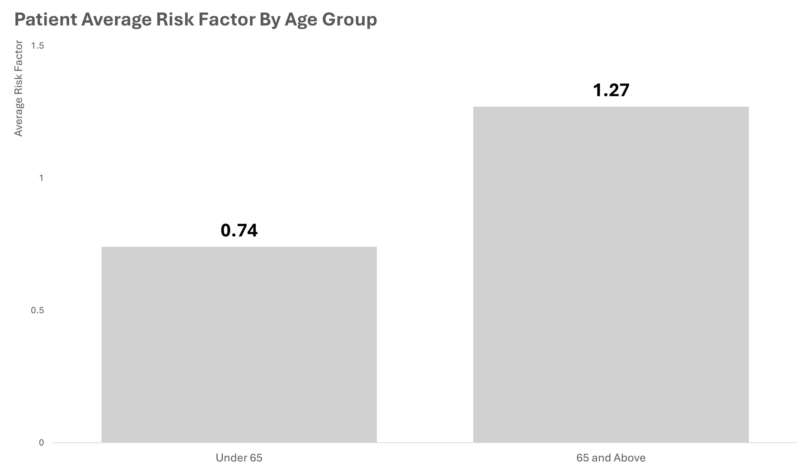
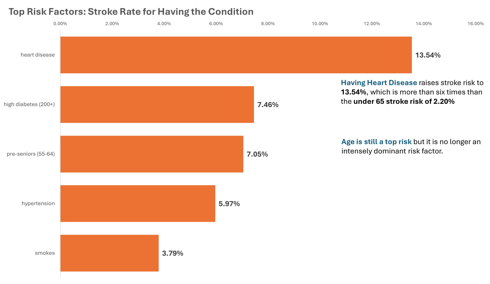
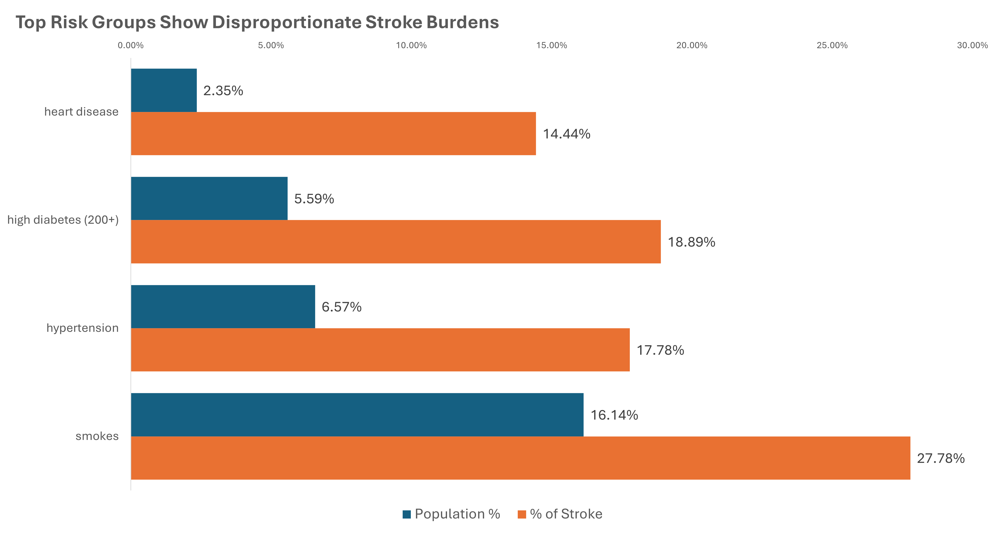
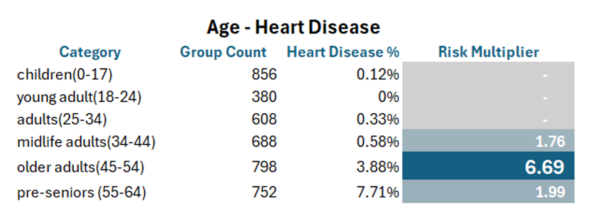
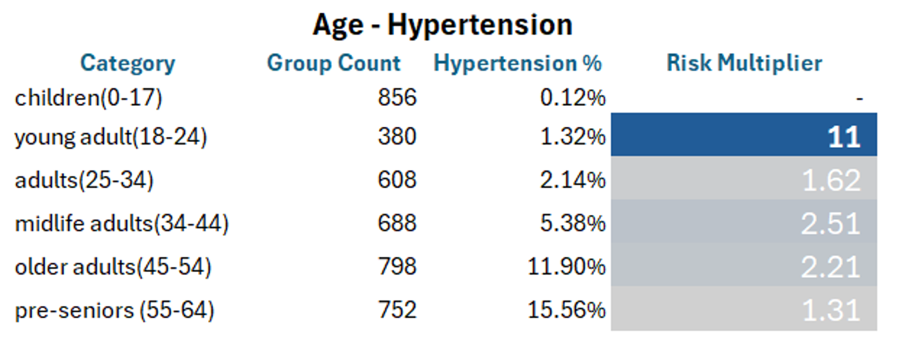
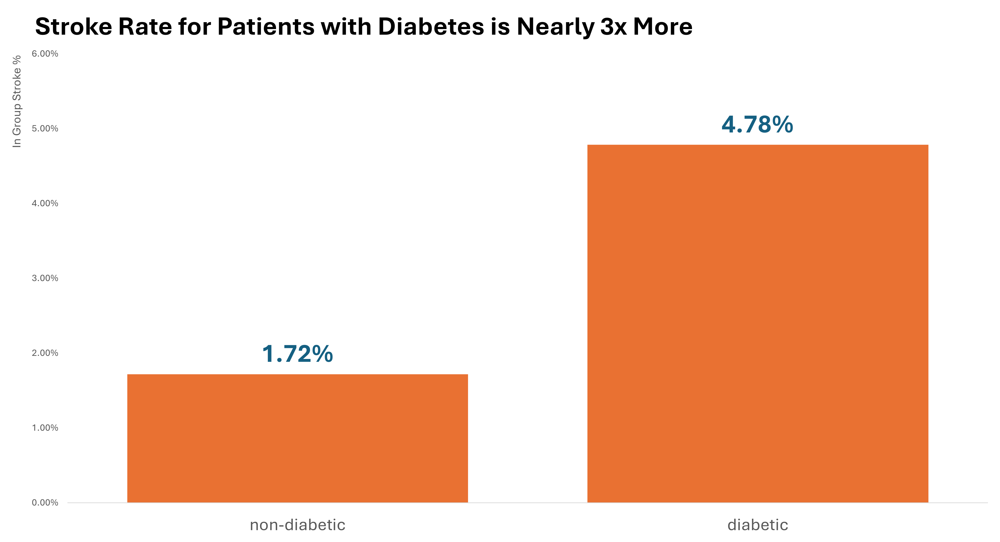
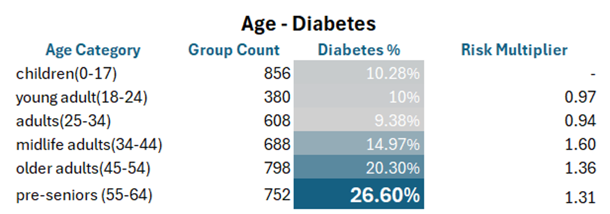
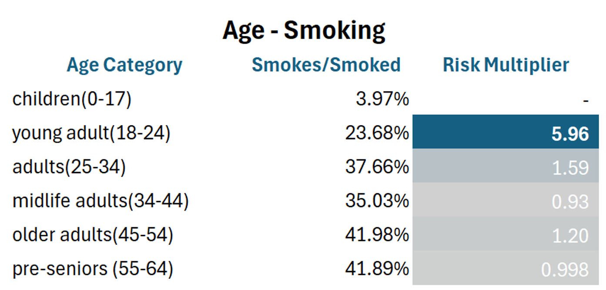

# Reducing Patient Stroke Risk for Patients Under Age 65

## Tools and Skills Used
- **SQL** (data wrangling, cleaning, and filtering)
- **Tableau** (Interactive Dashboard for User Exploration)
- **Excel** (data exploration, Chi-Square p-value Analysis, logging, visualization, and EDA)
- **Python** (Mann-Whitney Statistical Analysis)
- **Git and GitHub** (version control and repository)
- **Slide Deck** (Communication of Story Through Presentation and Walkthrough)

## Quick Access
- [Watch the Project Walkthrough](#)
- [Explore the Interactive Tableau Dashboard](https://public.tableau.com/views/Under65StrokeRiskDashboard/Dashboard1?:language=en-US&publish=yes&:sid=&:redirect=auth&:display_count=n&:origin=viz_share_link)
- [View Full Slide Presentation](#)

## Executive Summary

  
*Figure 1. Summary of Overall Category Statistical Representations*

Did you know that nearly **90% of stroke patients under 65 are married?** It's a surprising association, but this highlights the importance of remembering that *correlation is not causation*.   

While **age** is a well-known predictor of stroke, this project focuses on the **risk factors that emerge well before the age of 65**, particularly the **top medically alterable risk factors** that can be addressed through early intervention.    

**Key Findings include:**
- Patients with **heart disease** had a stroke rate of **13.54%** despite being just **2.35%** of the entire population.
- **Hypertension and diabetes** appear earlier than expected, showing sharp increase by age **25 - 35**.
- Stroke risk remains **elevated even after the patient quit smoking**, emphasizing the need for early behavioral intervention.  

These patterns suggests the need for **earlier screening and education**:
- **Hypertension and smoking risk**: assess by age **18**
- **Diabetes monitoring**: begin by age **25**
- **Heart disease screening**: start by age **35**  

## Data Information

This dataset contains *de-identified patient records with basic demographic info, medical history, and lifestyle habits*. The goal was to identify early stroke risk factors, so the formal analysis was limited to patients **under age 65**.

Below is a quick overview of the dataset structure:

### Dataset Schema

| Column Name        | Description                                | Data Type     |
|--------------------|--------------------------------------------|---------------|
| id                 | Unique patient ID                          | String        |
| gender             | Patient's gender                           | Categorical   |
| age                | Age in years                               | Numeric       |
| hypertension       | Whether the patient has hypertension (1 = yes) | Binary     |
| heart_disease      | Whether the patient has heart disease (1 = yes) | Binary     |
| ever_married       | Marital status                             | Categorical   |
| work_type          | Type of employment                         | Categorical   |
| residence_type     | Urban or rural residency                   | Categorical   |
| avg_glucose_level  | Average glucose level                      | Numeric       |
| bmi                | Body Mass Index                            | Numeric       |
| smoking_status     | Patient's smoking history                  | Categorical   |
| stroke             | Stroke occurrence (1 = yes)                | Binary        |

## Data Cleaning Summary  

- **201 missing BMI values** were imputed using the median. 
- All text fields were **standardized** for type, trimmed, and converted to lowercase.
- Filtered patient records 65 and above. 
- For the full details, please check the [cleaning log](docs/under65_cleaning_log.pdf)

## Exploratory Data Analysis (EDA) Summary  

- Continuous data assessed for shape, number summary, and outliers.
- Categorical data checked for consistency, data integrity, and transformed values into readable text.
- Categorical features assessed for **statistical significance using the Chi-Square p-value test** (found gender and residence type as insignificant).
- **Mann-Whitney Test** conducted for continuous data using **Python**, bmi, age, and average glucose level are confirmed statistically significant.  
- Demographics and health features assesses for *population representation, in-group stroke representation, and overall stroke case representation*.
- Age versus top risk factors (**medically modifiable**) analysis to gain insight on their occurence and progression with respect to age.
- Full and details can be found in the [EDA log](docs/under65_eda_log.pdf).

## Key Findings 

### Why Focus on Patients Under 65?

Age is a dominant predictor of stroke. Our original dataset contained 249 stroke cases and **159 of those stroke cases are patients that are 65 and above**. The dominance of age easily overwhelms and mask the effect of other risk factors.  

Patients over 65 in this dataset averaged more than one major risk factor (heart disease, hypertension, diabetes, and smoking). Younger patients, on the other hand, averaged less than one risk factor. By focusing on patient records under 65, we gain a clearer view of how individual risk factors affect stroke rate.  

  
*Figure 2. On average, patients under 65 have fewer risk factors, allowing for clearer analysis of individual risk impact.*

### Top Risk Factors Under 65

After filtering the data for patients under the age of 65, the dominance of age was tempered. In **Figure 3**, we can see which risk factors have the **strongest direct relationship** with stroke rate.

Pre-senior (55-64) is the third highest risk factor, age is still important but it is no longer overwhelmingly dictating stroke risk.

  
*Figure 3. Stroke risk is highest for patients with heart disease, uncontrolled diabetes, and pre-seniors. Age is still a predictor, but it is no longer the dominant factor.*  

### Risk Factor Disproportionate Stroke Burden

**Figure 4** visualizes the impact of the top risk factors. The top risk factors' contribution to the overall number of stroke cases is **disproportionately bigger** than their respective group population size.  

*Figure 4. Each top risk factor accounts for a much higher share of stroke cases than their share of the total population.*

### Heart Disease

**Heart disease** is the top stroke risk factor in this analysis. Patients with heart disease had an in-group stroke rate of **13.54%**. They represented just **2.35%** of the population, but accounted for **14.44%** of all stroke cases.

Prevalence of heart disease begins to accelerate by midlife. The number of patients with heart disease **increases sixfold** from adulthood (25–34) to midlife adulthood (35–44).

  
*Figure 5. Heart disease prevalence jumps significantly in midlife, suggesting a key window for screening.* 

### Hypertension 

According to the Centers for Disease Control (CDC) "*hypertension is a symptomless silent risk factor that can occur at any age*." Patients with hypertension have a stroke rate of **5.97%** and accounts for **17.78%** of stroke cases.  

**Figure 6** shows an eleven-fold jump of hypertension cases from childhood (**0-17**) to young adulthood (**18-24**). Early detection through regular blood pressure monitoring is key to combating this silent stroke risk factor.

*Figure 6. Hypertension prevalence jumps significantly. Blood pressure monitoring and care planning starting at age 18 is recommended.*  

### Diabetes

The in-group stroke rate for patients with diabetes (**4.78%**) is nearly **three times more** than patients without diabetes (**1.72%**). Diabetes is a prevalent risk factor such that it affects **1 in 5 patients ages 45–54** and even higher at **1 in 4 patients ages 55–64**.

  
*Figure 7. Combined diabetes and high diabetes group stroke rate is 4.78%.*

  
*Figure 8. 1 in 4 older adults and 1 in 5 pre-seniors have diabetes.*

### Smoking  

Patients who **smoke** have a stroke rate of **3.79%**, which is only slightly higher than the stroke rate of patients who **quit smoking** (**3.76%**).  

Nearly 1 in 4 patients have a history of smoking by young adulthood (ages 18–24). When it comes to smoking, **prevention** is the most effective strategy, since the stroke rate remains high even after quitting.

  
*Figure 9. Sharp increase in the number of patients that have a history of smoking during young adult stage.*  

## Recommendations

- Begin **routine hypertension screening** at age 18 through standard blood pressure checks in primary care.
- Launch **prevention and education efforts for smoking** by age 18, before risk levels spike.
- Initiate **diabetes screening and care planning** starting at age 25 for patients with elevated glucose or risk factors.
- Implement **heart disease screening protocols** by age 35, as prevalence increases sharply in midlife.

## Call to Action

- **Prevention is better than treatment** — stroke risk factors may develop **well before** the age of 65.
- Screening and prevention plans should begin as early as **age 18 to 35**, depending on individual risk factors.
- **Public health leaders and providers** can reduce the stroke burden by **updating protocols** and **targeting the right age groups**.
- **Future Work**: Build a **machine learning model** to estimate stroke risk based on each patient's **current health profile**, enabling individualized, proactive care planning.

## Links and Resources

- [Project Walkthrough Video](#)  
- [Interactive Tableau Dashboard](https://public.tableau.com/views/Under65StrokeRiskDashboard/Dashboard1?:language=en-US&publish=yes&:sid=&:redirect=auth&:display_count=n&:origin=viz_share_link)  
- [Slide Presentation](#)  
- [Excel Project Files (Cleaning, EDA, Statistical Testing)](docs/under65_stroke_risk_project.html) 
- [SQL Scripts (Filtering, Feature Grouping, Query)](SQL/)  
- [Python Script (Mann-Whitney Test)](python/mann_whitney_test.py)  
- [cleaning log](docs/under65_cleaning_log.pdf) 
- [EDA log](docs/under65_eda_log.pdf)

## How to Use This Project

This project presents a full end-to-end analysis of stroke risk in patients under age 65. It includes:

- SQL scripts used for filtering and structuring the raw dataset
- Excel and Python files for data cleaning, EDA, and statistical testing
- PDF logs documenting cleaning and exploration steps
- An interactive Tableau dashboard for data visualization
- A 3-minute walkthrough video and full slide presentation

All outputs are available in this repository. No setup is required unless you choose to replicate or extend the analysis. Start with the README and use the links above to explore the process, insights, and tools used.

